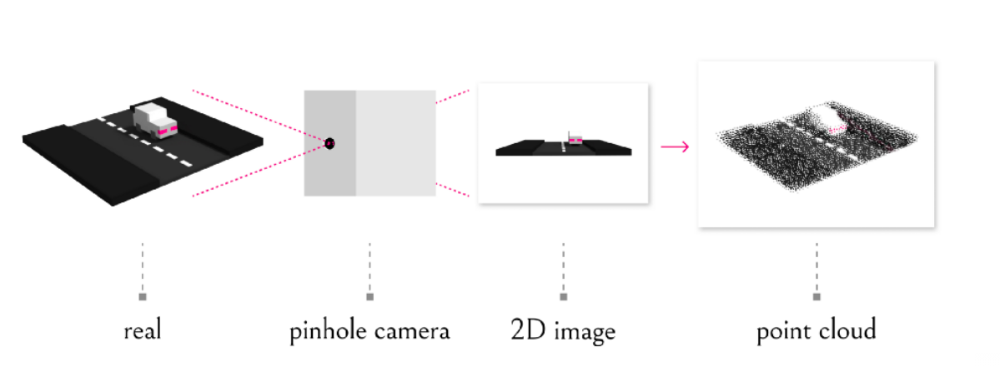
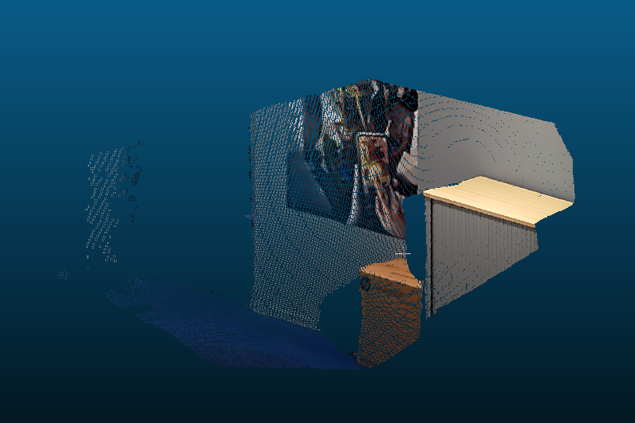
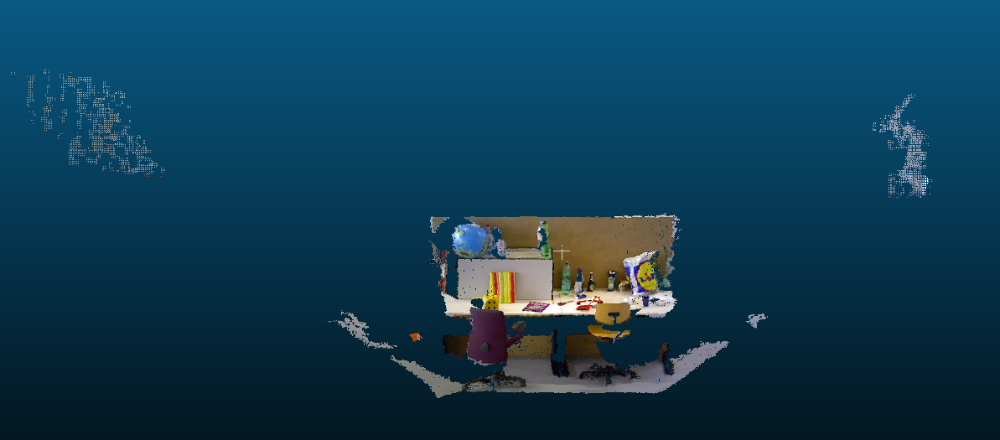

# 深度图转换为点云


深度图转换为点云是3D点投影到2D平面的逆过程，有以下两个基础知识需要了解
## 深度图
深度图中的单个像素值是空间中物体的某个点到垂直于镜头光轴并通过镜头光心（深度相机光学零点）平面的垂直距离
## 深度图与比例因子（scale_factor）
深度图对应的尺度因子是深度图中存储的值与真实深度（单位为m）的比例
```
depth_map_value / real_depth = scale_factor
```
通常情况下，深度值以毫米为单位存储在**16位无符号整数**中(0~65535)，因此要获得以米为单位的z值，深度图的像素需要除以比例因子1000。不过不同相机的的比例因子可能不同，比如TUM数据集的比例因子为5000，即深度图中存储的深度值的单位为200毫米

## 代码实现
代码主要参考了deep-video-mvs的代码实现

### 文件说明
dataset目录下存放了Hololens以及TUM的数据集，对应的目录下分别存放有:
```
 images: XXXXXX.png (RGB, 24-bit, PNG)
 depthmaps: XXXXXX.png (16-bit, PNG)
 point_clouds: XXX.ply (ply格式的点云)
 pose.txt: camera-to-world, 4×4 matrix in homogeneous coordinates
 K.txt: camera intrinsics(3×3 matrix)
```
如果没有pose.txt，那么在depth2Cloud.py中将view_ply_in_world_coordinate置为False，这时得到的点云的坐标是在前帧下的坐标
### 投影的逆过程

```python
#!/usr/bin/python3
def depth_image_to_point_cloud(rgb, depth, scale, K, pose):
    u = range(0, rgb.shape[1])
    v = range(0, rgb.shape[0])

    u, v = np.meshgrid(u, v)
    u = u.astype(float)
    v = v.astype(float)

    Z = depth.astype(float) / scale
    X = (u - K[0, 2]) * Z / K[0, 0]
    Y = (v - K[1, 2]) * Z / K[1, 1]

    X = np.ravel(X)
    Y = np.ravel(Y)
    Z = np.ravel(Z)

    valid = Z > 0

    X = X[valid]
    Y = Y[valid]
    Z = Z[valid]

    position = np.vstack((X, Y, Z, np.ones(len(X))))
    position = np.dot(pose, position)

    R = np.ravel(rgb[:, :, 0])[valid]
    G = np.ravel(rgb[:, :, 1])[valid]
    B = np.ravel(rgb[:, :, 2])[valid]

    points = np.transpose(np.vstack((position[0:3, :], R, G, B))).tolist()

    return points
```

### 将点云保存为ply格式
```python
#!/usr/bin/python3
def write_point_cloud(ply_filename, points):
    formatted_points = []
    for point in points:
        formatted_points.append("%f %f %f %d %d %d 0\n" % (point[0], point[1], point[2], point[3], point[4], point[5]))

    out_file = open(ply_filename, "w")
    out_file.write('''ply
    format ascii 1.0
    element vertex %d
    property float x
    property float y
    property float z
    property uchar blue
    property uchar green
    property uchar red
    property uchar alpha
    end_header
    %s
    ''' % (len(points), "".join(formatted_points)))
    out_file.close()
```

## 使用CloudCompare工具查看点云
### Hololens

### TUM


## 参考
[From depth map to point cloud](https://medium.com/yodayoda/from-depth-map-to-point-cloud-7473721d3f)

[deep-video-mvs](https://github.com/ardaduz/deep-video-mvs)

[如何将深度图转换为3D点云？](https://www.coder.work/article/2032574)
